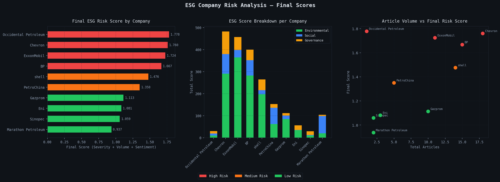

# 🛢️ ESG Controversy Signal Engine

> **An NLP-based decision-support system that automatically detects, scores, and summarizes ESG-related controversy signals for Oil & Gas companies from public text sources — flagging events with confidence scores for analyst review.**


---

## 🎯 Key Contributions & Highlights

- 🔧 **Designed and implemented end-to-end NLP pipeline** — ingestion → scraping → cleaning → tagging → sentiment → scoring → dashboard
- 📐 **Designed original ESG scoring formula** combining severity, volume (log-weighted), and FinBERT sentiment
- 🗂️ **Hand-curated dataset of 99 ESG controversy article URLs** across 10 major Oil & Gas companies
- 🤖 **Implemented FinBERT sentiment analysis** with chunk-based processing for long articles
- 📊 **Built company-level risk aggregation** with multi-label ESG classification and normalized scores
- 🖥️ **Deployed interactive Streamlit dashboard** with 5 analytical tabs for analyst review
- 🧪 **Performed model validation** including positive article inspection, correlation analysis, and sanity checks

---

## 📌 Project Overview

This project is an **internship-level prototype** that simulates an early-warning ESG risk detection system for Oil & Gas companies using historical public text data. It is designed for **learning and decision-support demonstration purposes**, not for live trading or production use.

The system ingests URLs from public news sources, scrapes article text, applies **keyword-based ESG tagging**, runs **FinBERT sentiment analysis**, and produces a **ranked ESG risk score** per company — combining controversy severity, article volume, and sentiment negativity.

---

## 🏗️ System Architecture

```
URLs (esg_links.txt)
        │
        ▼
┌─────────────────┐
│  01_ingestion   │  → Parse URLs → esg_articles_raw.csv
└─────────────────┘
        │
        ▼
┌─────────────────┐
│  02_extraction  │  → Scrape text + dates → esg_articles_with_text.csv
└─────────────────┘     (requests + BeautifulSoup + archive.org fallback)
        │
        ▼
┌─────────────────┐
│  03_cleaning    │  → Filter + validate → esg_articles_cleaned.csv
└─────────────────┘     (min 200 chars + company mention check)
        │
        ▼
┌─────────────────┐
│  04_esg_tagger  │  → ENV / SOCIAL / GOV keyword scoring → esg_articles_tagged.csv
└─────────────────┘
        │
        ▼
┌─────────────────┐
│  05_sentiment   │  → FinBERT analysis → esg_articles_final.csv
└─────────────────┘                     → esg_company_sentiment.csv
        │
        ▼
┌─────────────────┐
│  06_aggregator  │  → Company-level risk scores → esg_company_scores.csv
└─────────────────┘
        │
        ▼
┌─────────────────┐
│  07_visualizer  │  → Matplotlib charts → esg_risk_analysis.png
└─────────────────┘
        │
        ▼
┌─────────────────┐
│  app.py         │  → Streamlit interactive dashboard (5 tabs)
└─────────────────┘
```

---

## 📁 Project Structure

```
esg_controversy_signal_engine/
│
├── 📄 esg_links.txt                    # Input: company,URL pairs (99 entries)
│
├── 🐍 01_ingestion.py                  # Parse URLs → raw CSV
├── 🐍 02_extraction.py                 # Scrape articles (requests + BS4)
├── 🐍 03_cleaning.py                   # Clean + filter articles
├── 🐍 04_esg_tagger.py                 # ESG keyword scoring + multi-label
├── 🐍 05_sentiment.py                  # FinBERT sentiment + validation
├── 🐍 06_aggregator.py                 # Company-level risk aggregation
├── 🐍 07_visualizer.py                 # Matplotlib visualizations
├── 🐍 app.py                           # Streamlit dashboard (5 tabs)
│
├── 📊 data/
│   ├── esg_articles_raw.csv
│   ├── esg_articles_with_text.csv
│   ├── esg_articles_cleaned.csv        # 81 articles after filtering
│   ├── esg_articles_tagged.csv
│   ├── esg_articles_final.csv
│   ├── esg_company_sentiment.csv
│   └── esg_company_scores.csv          # Final risk rankings
│
├── 📈 esg_risk_analysis.png
├── 📄 requirements.txt
└── 📄 README.md
```

---

## 📊 Output Preview

### ESG Risk Analysis Chart



*Three-panel output: (Left) Final risk scores ranked by company, colored by risk tier. (Center) Stacked ENV/Social/Governance keyword totals per company. (Right) Article volume vs final score scatter — Occidental Petroleum demonstrates high-severity single-article outlier effect.*

### Sample Output — `esg_company_scores.csv`

| Rank | Company | Articles | Controversy Score | Avg Sentiment | Final Score | Risk Tier |
|------|---------|----------|-------------------|---------------|-------------|-----------|
| 1 | Occidental Petroleum | 1 | 2.227 | -0.7308 | 1.778 | 🔴 High Risk |
| 2 | Chevron | 18 | 2.337 | -0.4152 | 1.760 | 🔴 High Risk |
| 3 | ExxonMobil | 11 | 2.327 | -0.3180 | 1.724 | 🔴 High Risk |
| 4 | BP | 15 | 2.188 | -0.4503 | 1.667 | 🔴 High Risk |
| 5 | Shell | 14 | 1.932 | -0.4105 | 1.476 | 🟠 Medium Risk |
| 6 | PetroChina | 5 | 1.699 | -0.5354 | 1.350 | 🟠 Medium Risk |
| 7 | Gazprom | 10 | 1.421 | -0.3932 | 1.113 | 🟢 Low Risk |
| 8 | Eni | 3 | 1.508 | -0.0846 | 1.081 | 🟢 Low Risk |
| 9 | Sinopec | 2 | 1.256 | -0.5986 | 1.059 | 🟢 Low Risk |
| 10 | Marathon Petroleum | 2 | 1.126 | -0.4960 | 0.937 | 🟢 Low Risk |

---

## 🔬 Methodology

### 1. Data Collection
- **Manual URL curation** from public sources: Guardian, BBC, NPR, CNBC, Reuters (archive.org fallback), AP, Al Jazeera
- `requests` + `BeautifulSoup` scraping with **7-second polite delays** between requests
- `archive.org` used as fallback to recover blocked/dead Reuters URLs
- **86/99 articles successfully scraped (87% success rate)**
- Failures breakdown: 5 paywalled sites (NYT/WSJ/Economist — 403/401), 2 JS-rendered pages (0 chars), 1 timeout

### 2. ESG Keyword Tagging (Rule-Based)

| Category | Example Keywords | Score Weight |
|----------|-----------------|--------------|
| 🌿 Environmental | pollution, spill, emission, carbon, climate, toxic, deforestation, methane, co2 | 50% |
| 👥 Social | human rights, labor, indigenous, health, safety, discrimination, cancer, evacuation | 30% |
| ⚖️ Governance | corruption, fraud, bribery, lawsuit, settlement, sanction, pension, deficit | 20% |

- Raw keyword counts using word-boundary regex (single words) and direct match (phrases)
- Scores **normalized per 1,000 characters** for fair cross-article comparison
- Multi-label binary flags: `is_env`, `is_social`, `is_gov` (threshold: score > 5)

> ⚠️ **Tagging note:** Keyword tagging is rule-based without formal ground truth evaluation. Category distribution (64% ENV / 19% GOV / 17% SOC) is consistent with known Oil & Gas ESG risk profiles and manually verified for a sample of articles.

### 3. Sentiment Analysis (FinBERT)
- Model: [`ProsusAI/finbert`](https://huggingface.co/ProsusAI/finbert) — BERT fine-tuned on financial news sentences
- Long articles chunked into **~400-word segments**, sentiment averaged across chunks
- Output labels: `positive`, `neutral`, `negative` with confidence score per chunk
- **Runtime:** ~2-3 minutes for 81 articles on CPU
- **Known limitation:** FinBERT trained on general financial news — effectively detects **governance negatives** (lawsuits, fines, penalties = financial language ✅) but underperforms on **environmental and social negatives** (ecological harm, displacement, health impacts = non-financial language ❌). This is the root cause of the observed 35% neutral rate despite articles being genuine controversies. Measured ENV-sentiment correlation: **+0.389** (documented bias)

### 4. Final Risk Scoring Formula

```
severity      = (avg_env_norm × 0.5) + (avg_social_norm × 0.3) + (avg_gov_norm × 0.2)
volume        = log1p(total_articles)
controversy   = (severity × 0.7) + (volume × 0.3)
final_score   = (controversy × 0.7) + (|avg_sentiment| × 0.3)
```

**Why these weights:**
- `log1p(volume)` — compresses article counts fairly; prevents one company with 20 low-quality articles outranking one with 5 high-intensity ones
- Normalization per 1,000 chars — intensity comparison, not raw volume
- ENV 50% weight — primary ESG risk driver for Oil & Gas sector
- Absolute sentiment — captures negativity magnitude regardless of sign direction

---

## 📈 Results & Key Insights

- **Occidental Petroleum ranks #1** despite only 1 article — sentiment of -0.73 (Amazon indigenous lawsuit) shows the formula correctly captures single high-severity events
- **ExxonMobil has highest raw severity (1.582)** — driven by climate denier funding + plastic recycling investigation articles
- **Gazprom: volume ≈ severity (0.719 vs 0.702)** — many medium-intensity geopolitical articles, no single catastrophic event
- **63% of articles (51/81) scored negative** by FinBERT — consistent with a controversy-focused dataset

### Sentiment Distribution

| Label | Count | % |
|-------|-------|---|
| Negative | 51 | 63% |
| Neutral | 28 | 35% |
| Positive | 2 | 2% |

> The 2 positive articles: Chevron AP earnings report (stock up) and Shell CNBC net-zero pledge — both financial/PR tone, not controversy. Expected and confirmed via manual inspection.

---

## ✅ Validation

| Check | Method | Result |
|-------|--------|--------|
| Scraping success rate | Count non-null `raw_text` | 87% (86/99) |
| Positive article review | Manual text inspection | Both explained (earnings/PR tone) |
| Top 5 negatives sanity check | Manual URL verification | All confirmed genuinely negative |
| Neutral with high ESG scores | Cross-tab analysis | Long articles averaging chunks to ~0 (expected) |
| Sentiment-controversy correlation | `df.corr()` | Negative correlation confirmed |
| ENV-sentiment bias | Correlation check | +0.389 (FinBERT limitation, documented) |
| Category distribution | Value counts | 64/19/17% ENV/GOV/SOC — consistent with Oil & Gas |

---

## ⚙️ Installation & Runtime

```bash
# 1. Clone
git clone https://github.com/yourusername/esg_controversy_signal_engine.git
cd esg_controversy_signal_engine

# 2. Install
pip install -r requirements.txt

# 3. Run pipeline
python 01_ingestion.py
python 02_extraction.py
python 03_cleaning.py
python 04_esg_tagger.py
python 05_sentiment.py       # Downloads FinBERT ~500MB on first run
python 06_aggregator.py
python 07_visualizer.py

# 4. Launch dashboard
streamlit run app.py
```

### Approximate Runtime (CPU)

| Step | Approx Time |
|------|-------------|
| Ingestion | < 5 sec |
| Scraping (86 URLs × 7s delay) | ~10 min |
| Cleaning + Tagging | < 15 sec |
| Sentiment (81 articles, CPU) | ~2–3 min |
| Aggregation + Visualization | < 10 sec |
| **Total** | **~13–15 min** |

---

## 📦 Dependencies

| Package | Purpose |
|---------|---------|
| `pandas`, `numpy` | Data manipulation |
| `requests`, `beautifulsoup4` | Web scraping |
| `matplotlib` | Static visualizations |
| `transformers`, `torch` | FinBERT sentiment model |
| `streamlit` | Interactive dashboard |

---

## ⚠️ Known Limitations

| Limitation | Impact | Suggested Fix |
|-----------|--------|---------------|
| Manual URL curation | Not scalable | Google News RSS / NewsAPI automation |
| FinBERT not ESG-specific | Detects monetary negatives (fines, lawsuits) well but misses environmental/social harm language (spills, displacement, health impacts) as neutral — causing 35% neutral rate in a controversy dataset | Fine-tune on ESG-labeled corpus |
| No keyword tagging ground truth | Can't report precision/recall | Manual annotation of sample articles |
| Static dataset | No live updates | Scheduled scraping pipeline |
| JS-rendered pages missed | ~2 articles lost | Selenium integration |

---

## 🚀 Future Improvements

- [ ] Automated URL discovery via Google News RSS / NewsAPI
- [ ] Fine-tune FinBERT on ESG-labeled corpus for domain accuracy
- [ ] Time-series ESG risk scoring per company over years
- [ ] Named Entity Recognition to auto-extract company mentions
- [ ] Formal keyword tagging evaluation with annotated ground truth
- [ ] Expand dataset to more sectors beyond Oil & Gas

---

## ⚠️ Disclaimer

Internship-level prototype using historical public data. **Not for investment decisions or production ESG reporting.** Results are demonstration signals for analyst review only.

---

## 📄 License

MIT License — free to use for educational and research purposes.
